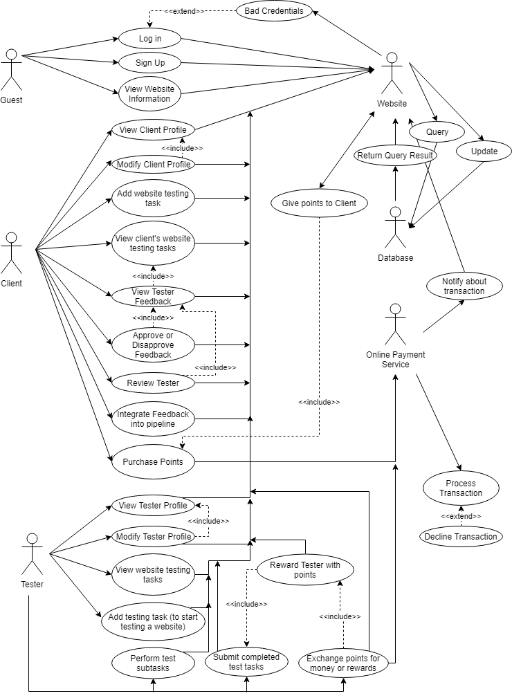
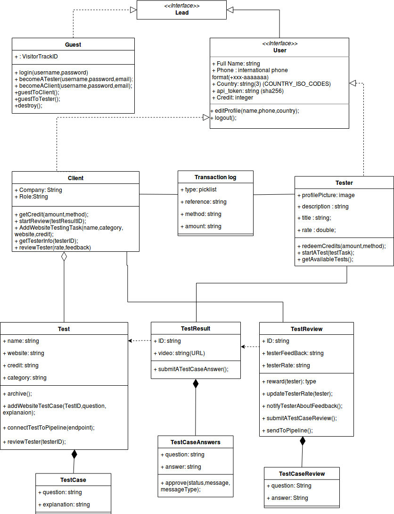
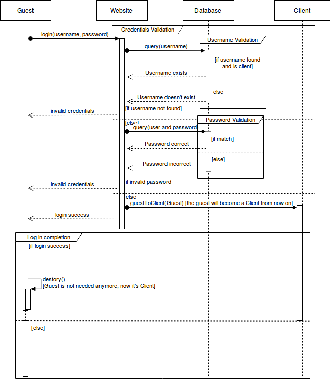
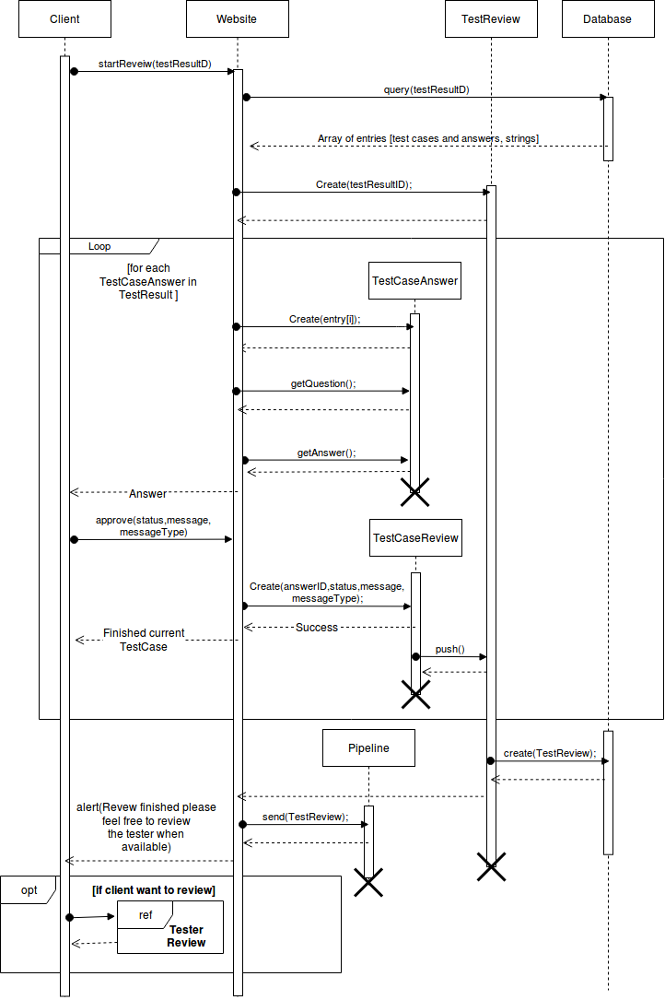
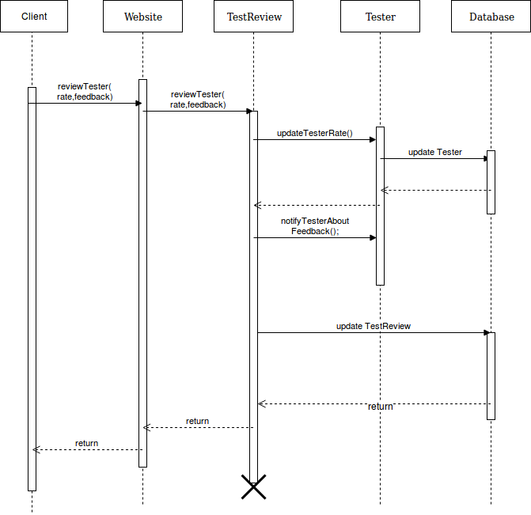

# Summary

JarVis is a website that aids web developers
in User Acceptance Testing. The developers can add their sites and
create testing tasks. Testers can view these posted tasks and perform
them to earn points and redeem them for payment.

This project was created as a fulfillment to the Web Development and Software Engineering courses.

This repository contains the project report (shown below), alongside with screenshots and diagrams of the project content.

# Table of Contents

- [Summary](#summary)
- [Table of Contents](#table-of-contents)
- [Introduction](#introduction)
  - [Project Overview](#project-overview)
    - [What is our project?](#what-is-our-project)
    - [Why did we choose this project?](#why-did-we-choose-this-project)
  - [User Acceptance Testing](#user-acceptance-testing)
    - [What is User Acceptance Testing?](#what-is-user-acceptance-testing)
    - [Why is UAT challenging?](#why-is-uat-challenging)
    - [A solution for UAT?](#a-solution-for-uat)
    - [UAT challenges in the Arab world](#uat-challenges-in-the-arab-world)
- [Requirements](#requirements)
  - [Functional Requirements](#functional-requirements)
    - [Guests](#guests)
    - [Clients](#clients)
    - [Testers](#testers)
  - [Non-functional Requirements](#non-functional-requirements)
    - [Scalability](#scalability)
    - [Maintainability](#maintainability)
    - [Reliability and Availability](#reliability-and-availability)
    - [Usability](#usability)
    - [Privacy](#privacy)
    - [Safety and Security](#safety-and-security)
- [System Models](#system-models)
  - [Use Case Diagram](#use-case-diagram)
  - [Class Diagram](#class-diagram)
  - [Sequence Diagrams](#sequence-diagrams)
    - [Client Log In](#client-log-in)
    - [Reviewing Completed Tasks](#reviewing-completed-tasks)
    - [Reviewing Testers](#reviewing-testers)
- [Implementation](#implementation)
  - [Back-end](#back-end)
  - [Front-end](#front-end)
  - [Key features](#key-features)

# Introduction

## Project Overview
In this section, we'll briefly talk about our project, its nature and the reasons for choosing it.

### What is our project?

*Jaribni Visually (JarVis)* is a web application which aims is to provide web application **user acceptance testing**. Clients can come and apply their websites for testing, and select certain qualities for the tester. Testers then can select the websites that they want to test, and provide a detailed test including completing sub-tasks and recording very detailed videos about their interactions with the website, which they will submit for the clients to see. Each client can purchase points which they can assign to their websites. These credits are earned by the testers when they perform a full task, and can later exchange them for money or rewards.

### Why did we choose this project?

User Acceptance Testing (UAT) is a big challenge, and especially in the Arab world. We aim in our project to provide UAT for web application testing, and especially if the target users of these websites are Arab users.

## User Acceptance Testing

In this section we will briefly explain User Acceptance Testing, and relate it to our project.

### What is User Acceptance Testing?

User Acceptance Testing (UAT) is the last kind of testing performed on a product in the software development cycle, which involves testing the application on real users, with real data, in a real working environment. UAT is a very important part in the software development cycle, because it tests if your product can be used by your targeted client, if it is actually what they expect or need from it and if there are any problems that might encounter them while they're using it. There are multiple groups of people that should be included in the UAT of an application. Probably the most important group is real end users who are going to use the application.

### Why is UAT challenging?

UAT is considered one of the toughest things to deal with in a project, and for many reasons. A company could release their application for public to test, but there are problems revolving around that, because the application might not have the good qualities that the public expects, which might cause a huge backlash and damage the application’s reputation, which could be very hard to recover from. It also is not easy for the company to select a few end users to come and test the application, because this will add a lot of extra work on the project, to select suitable people and classify them, to explain to them what the should be looking for and to manage them all and receive their feedback consistently.

### A solution for UAT?

As a result of UAT being challenging for companies, there are some services were created to help with it. These services can provide you with actual real people to test, interact and give feedback to your applications, and most importantly, all the management of this is handled by the service, so all the company has to do is put their application to the test, and wait for the testing feedback.
The problem is, because these services depend on people that test the application, they are very region-dependent. That means that if your application is targeting people in a certain region, you’ll need to find a service that provides you with people from that region. 

### UAT challenges in the Arab world

As discussed in the previous subsection, the services that provide UAT handling and management to companies are very region dependent. In the Arab world, this problem is very significant, as there are not many (if any) services that provide end user testers who can understand or use the Arabic language. This re-raises the discussed problems about UAT in the Arab world, and makes development for application whose targets are Arab more complicated.

# Requirements
To collect the basic requirements for our project, we mainly took inspiration for similar existing applications. We also added some new requirements that we thought are good features to have in our application. We are going to talk about the **functional requirements**, which describe what our system will do and how it should behave, **non-functional requirements**, which describe the characteristics and restrictions that our application should follow as a whole.

## Functional Requirements
In this section, we're going to talk about the functional requirements of our application.
Our application will have three types of users: guests, clients and testers.

### Guests
Guests are the unregistered users of our websites. From the nature of our website, we can conclude that guests cannot do much on the website. Guests can:

- Sign Up: The guest can sign up to the website. This way, they can either provide the websites that they want to test (be a client) or become a tester and test websites provided by the clients.
- Log in: The guest can log in to access their accounts if they have any. The guest can log in either as a tester or a client.
- View general information about the website, its functionality, and what it offers for both testers and clients.

### Clients
Clients are the registered users who want to submit their web applications for testing. Clients can:

- View and modify their profile.
- Purchase points which they assign to any website that they want to be tested.
- Add website testing tasks, which including configuring their tester requirements and assigning points to be earned by testers.
- View all website testing tasks that they have created.
- View individual tester feedback from website testing task.
- Approve or disapprove the test feedback with a full explanation of strength and weakness points of the feedback.
- Give a review to the tester.
- Integrate the results of a website testing task to his pipeline using a  RESTful API structure.

### Testers
Testers are the registered users who perform testing tasks on the web applications submitted by the clients. Testers can:

- View and modify their profile.
- View available websites that require testing. The websites that can be viewed are the ones that the tester meets the requirements for their(websites) testing.
- Add a website to his testing tasks. The number of testing tasks that a user can have concurrently is limited.
- Perform the testing tasks that he has.
- Submit completed test tasks to earn points.
- Convert points into money that can be transferred to them via online payment systems such as PayPal.

## Non-functional Requirements
In this section, we’re going to talk about the non-functional requirements of our application. 

### Scalability

The system we are going to build should be able to scalable. As the user base grows, we want to be able to expand our system to support different regions. We also want to keep the system open for the implementation of any new technologies that can help in its purpose.

### Maintainability

The system should have a high level of maintainability. Due to the system's nature and purpose, the user base may be big and problems will probably start rising, so our system should be open for any additions and fixes.

### Reliability and Availability
The system should have a very high level of reliability. Especially for the testers, the system should be always available and should fail as little as possible. If any failures happen, the system should regularly save the progress done on it to minimize losses, and should have periodic backups.

### Usability

Because we want to provide real end users to test systems, those user probably do not have a lot of technical background. As a result, we need to make sure that our website is user-friendly, with clear instructions on what to do and a simple interface.

### Privacy

The information about the client should not be revealed to the testers, or vice versa, to prevent self-biased reviews and review rejections. We also need to make sure that those reviews are private to the tester and the client involved in them, and should not be accessible by anybody else.

### Safety and Security

Access to anything on the page should be controlled using sessions, to prevent any unauthorized access.
Moreover, our system deals with online payments, which raises the need for a high level of security. The payment system should be implemented using official and certified online payment tools and methods.
    
# System Models
After the requirements for the application are prepared in natural language, they should be presented in a less ambiguous, more standardized form. We are going to convert our requirements into standard Unified Modeling Language (UML) models to represent the system. We are going to use three UML diagrams, the **use case diagram**, the **class diagram** and the **sequence diagram**.

## Use Case Diagram
The Use Case Diagram is a UML diagram which includes all the actors in the system, with the use cases (actions and functionalities) that they perform.
Our use case diagram consisted of six actors:

- **Guest:** Non-logged in user. They have some basic use cases.
- **Client:** The client who wants their website tested. A lot of the use cases are related to them.
- **Tester:** The tester who tests websites. A lot of the use cases are related to them too.
- **Website:** It mostly receives requests from other actors, and sometimes sends some, mainly to the database.
- **Database:** Has querying and updating use cases.
- **Online Payment Service:** Does the actions of verifying and processing of money transactions.

The actions done by guests, clients and websites were previously explained in the requirements.

The following figure shows the Use Case Diagram that we built containing the main functionalities of our website.

## Class Diagram
The Class Diagram is a UML diagram which includes all interfaces and classes needed for an Object-Oriented implementation of the system, with each class including all of its fields and methods. The class diagram also defines all the relationships between the different classes and interfaces.
We analyzed our requirements, and extracted the following needed classes and interfaces:

- **`Lead`: (Interface)** This interface represents the lead. It represents everybody that visits the web application, them being a guest, client or tester. The purpose of this interface is to have more structural way of measuring how many of our site visitors became a paying customers (clients), or a user of our service like the tester and how just many fail to take action and register in the site.
- 
- **`Guest`:** This class implements the **`Lead`** interface. It represents the people who are not active on the website using a registered account. It has methods that enable it to log into the system or sign up.

- **`User`: (Interface)** This interface extends the **`Lead`** interface, and it represents a registered user which can either be a client or a tester. It has basic fields that we collect about each user, and basic methods such as logging out.

- **`Client`:** This class implements the **`User`** interface and represents the user who is registered as a client who has web applications which need testing. It has methods that allow it to buy points, add testing tasks, review and approve or disapprove testing task results, and reviewing testers who completed their testing tasks.

- **`Tester`:** This class implements the **`User`** interface and represents the user who is registered as a tester who wants to complete provided testing tasks. It has methods that allow it to redeem points for money or rewards, view, start and complete testing tasks, including starting and finishing individual test cases in those testing tasks.

- **`TransactionLog`:** This class represents the logging of transaction processes either from clients or testers. The information stored in an object of this class is obtained from the Online Payment System output. It has fields that represent this data, such as the date of transaction, its type, reference ID and amount.

- **`TestTask`:** This class represents the testing task that the clients create for the testers to complete. `Client` objects contain a number of `TestTasks`s, which means that there is an aggregation between them. We did not choose composition because we want to keep the `TestTask`s saved even if a client leaves the service for logging reasons. It basically acts as a connector between the client and the test cases that are in the test process.

- **`TestResult`:** This class represents the result submitted by the tester to the client. A `TestResult` cannot be created without an associated `TestTask`, which means that there is a dependency relationship between them. The `TestTask` acts as a container that holds all the individual test case answers that result from completing test case tasks.

- **`TestReview`:** This class represents the client feedback about the test result. A `TestReview` cannot be created without an associated `TestReview` since it depends on the test task results, which means that a dependency relationship should exist between them. The `TestReview` contains fields to store review of the test task result as a whole, and contains individual test case reviews which review each test case (rather than a whole `TestTask`) individually.

- **`TestCase`:** This class represents one sub-task which the tester should to to progress in completing a test task. One `TestTask`s consists of multiple `TestCase`s, which means that there is a composition relationship between them. The `TestCase` holds fields which store the specifications of what does the client exactly want the tester to do in the given testing sub-task.

- **`TestCaseAnswer`:** This class represents the result of completing one testing sub-task. One `TestResult` consists of multiple `TestCaseAnswers`, implying that a composition relationship should be between the two. The `TestCaseAnswer`s has fields which hold the result of testing and feedback from the tester to the client about the given testing sub-task.

- **`TestCaseReview`:** This class represents the client feedback about one individual test sub-task. Each `TestReview` can contain of one or more `TestCaseReviews`, which means that a composition relationship should be between the two. The `TestCaseReview` has fields that hold the client feedback to the tester about their result of one testing sub-task. The client is not forced to review and give feedback on each answer separately and can choose to ignore it.

The following figure shows the class diagram that we designed for our application.

]

## Sequence Diagrams
The Sequence Diagram is a UML diagram which describes the behavioral timeline of a certain functionality in the system. It describes exactly how different actors interact with each other through a sequence of actions.

### Client Log In
The sequence diagram shown in the following figure explains the sequence of actions for a guest to log in as a client.

Firstly, the guest requests the log in from the website, sending their credentials. The website then queries the data to see if that username exists and if the entered username is a client account. If not, it will return an invalid log in request to the guest, but if they are correct, it will query the database again to check if the given password is the correct password for the username entered. If not, it will return an invalid log in request to the guest, but if it is correct, it will create a `Client` object (since the guest is now not a guest anymore and a client). If the guest receives a successful log in request, it will destroy its object (because the user now will be using the created `Client` object instead).

### Reviewing Completed Tasks

- **Purpose:** An example of how the application will handle a task review call from a client and how it will represent the answers of the test results he received from the tester.

- **Summary:** the system will show the user the answers of the tester of each testing sub-task of his test task independently then he can approve or disapprove this answer and give a comment of approval or disapproval. The message of approval can also be a written in a Behavioral Driven Development (BDD) framework like Cucumber or SpecFlow. After the client finishes all the answers of this test result the system will feed this data to the integrated pipeline. Lastly, the system will ask the client to review the tester and rate him.

### Reviewing Testers

- **Purpose:** An example of that how the application will handle a tester review call from a Client.
  
- **Summary:** the system will ask the user to give a rating for this tester, and also to give the tester a feedback on his work. After that, the system will receive this information and will update the tester rating and notify them about the feedback they received from the client. Lastly, the website updates the test review instance in the database to contain the data the client just provided.

# Implementation
In this chapter, we will explain our approach to implement the proposed system.

## Back-end
For the back end, an Apache HTTP server with Laravel framework (for PHP) was used.
Laravel is a model view controller (MVC) PHP framework that splits the application into three separate parts, the model which represents the data, the controller which represents the logic and the view which represents the user interface. Only  the model and the controller were used because a different framework was used for front end development.

All communication to the server was done via AJAX requests, without the access directly to any PHP files. To implement that, we followed the RESTful convention, which deals with each object as a resource that can be operated upon using five operations, store, update, delete, list and show, to build an API for our application. Each resource has its own endpoint (route) which receives and handles the AJAX requests. The endpoint receives the AJAX request and sends it to that resource's controller for the controller to perform the required logic from the request. Refer to [resource handling](./resource-handling.md) for an example on the handling a resource, and [API endpoints](./api-endpoints.md) for a list of all API endpoints. 
However, if anybody knows these endpoints, they can start sending AJAX requests to it and access the controller without any proper authentication, which makes the system severely vulnerable.

The Auth2 convection was followed to handle the authentication in the website. The idea is that each user who wants to access the system is provided with a system-generated bearer authentication token when they log in into the system. Then, with any request that the user needs to send to the server, that token must be included in the head of that request. If the token is not present in the header, the server rejects the request.

This token is stored in the server side and is checked on every request. Moreover, the token has an expiry time, and it becomes revoked after that time passes. From the token, the requesting user with all of their information can be identified for checking whether that user can access and use the endpoints or not. The token is very large and with a variable length, so trying to use brute force  to find a valid token is near impossible.

Token validation is done through a middle-ware layer, which is the authentication API mentioned previously. Refer to [authentication examples](./authentication-examples.md) for an example on authenticated requests and responses. 

Now, the front end should not directly communicate with the API, so another set of endpoints was needed to receive requests from the front end and use the API endpoints to execute the required tasks. The same authentication method was also used for these endpoints. Refer to [request endpoints](./request-endpoints.md) for a list of all request endpoints.

## Front-end
For the front end, the Vue JS framework was used. 
Vue JS enables you to build templates from HTML (or other Vue components) and build your own components. This way, class-based styling libraries (e.g. Bootstrap) can we wrapped in a template, and then treated and used in the application as if it was a defined HTML tag. In this project, pre-built Vue components were used. Moreover, custom events and attributes can be defined for those elements, which gives it high flexibility. Data binding, too, is one of Vue's most powerful functionalities, where certain JavaScript variables can be bound to an element in the document, and whenever the elements changes the data (e.g. text input), the variable data is changed and vise versa. This eliminates the need of manually accessing the DOM, and any needed data from the DOM can easily be bound to a variable and used at will. Those variables can also be stored somewhere externally and imported from outside sources, which is a better practice because this way there will only be one 'source of truth' from which all the data is bound. To implement that, a state management library dedicated for Vue called 'Vuex' was used. Vuex makes data management very easy, with one 'store.js' file that holds all the data needed for the application. Components still can define and use local data, but for shared data, the Vuex store is the source of truth.

However, Vue is not understood by the browser directly. The Vue files need to be built and transformed into files which the browser can understand, which might get messy because some external libraries, such as Bable which formats 2015 ES into older ES syntax to support older browsers, might need to be used to achieve this. Fortunately, Vue provides a command-line interface (Vue CLI) that is integrated through Node JS and provides commands to install all the necessary libraries and build the Vue application easily. Refer to [Vue example](./vue-example.md) for an example of a Vue component with integrated Vue CLI. 

Since Vue CLI is integrated through Node JS, that means that the Vue application can run on a Node JS server by itself. This way, the front end and back end are completely separated, which is beneficial as this causes the dependency between them to be as low as possible, but the communication between the front end and back end still needs to be set up. As mentioned before, this communication was completely done via AJAX requests. We used the axios library which allows us to send AJAX requests and receive responses in a very easy way. The request endpoints defined at the back end side were used by those AJAX requests to interact with the back end. However, we mentioned a token that was needed to check for authentication, so it had to be dealt with at client side. The front end side receives the token whenever a user successfully logs into the system, and stores it in the local storage.

Vue JS also supports single-page applications. There usually is one HTML index file with a container inside of it that Vue puts all of its outputs there. A web page in Vue is built as a component, so everything needed to move between pages is to replace the component displayed in that container in the index file with a component that represents a different page. There is no direct way to achieve this in Vue, but there is a library called 'Vue Router', which is especially built for this purpose. The library uses a file named 'routes.js' to define routes and bind those routes to Vue components that represent whole pages, and whenever one of those routes is requested in the browser, the vue router handles that request and places the needed component in the needed place. The router also defines a global JavaScript object which can be used from within the Vue components themselves to request a route for re-directions. Refer to [router examples](./router-examples.md) for an example on the 'router.js' file and the use of the router in components. 

Refer to [screenshots](./screenshots.md) for screenshots of the front end.
## Key features
- PayPal integration (you can pay through PayPal and the credit will be added to your account).
- RESTful API with 5 different resources.
- Password reset.
- Auth2 authentication system.
- SPA (single page application).
- Using Laravel in the back end.
- Using Vue JS and many related libraries in the front end.
- Completely separate front end and back end. Each can run on their own server.
- Continuous integration and deployment available (each time we push to GitHub the changes are deployed to an online server).

